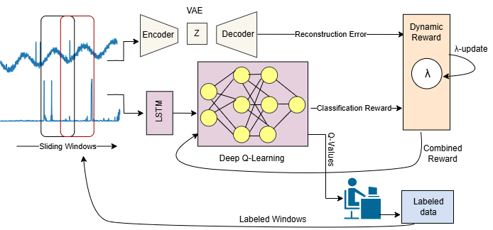

# Dynamic Reward Scaling for Reinforcement Learning in Time Series Anomaly Detection

<div align="center">
  
</div>

A semi‐supervised RL framework for time‐series anomaly detection.  
Combines a Variational Autoencoder (VAE), an LSTM‐based DQN, dynamic reward shaping (λ), and active learning to detect anomalies with minimal labels.

---

## Features

- **VAE Module**  
  Learns “normal” patterns and provides reconstruction‐error as intrinsic reward.

- **DQN Agent (LSTM)**  
  Classifies sliding windows as normal/anomalous.

- **Dynamic Reward (λ)**  
  Balances intrinsic (VAE) and extrinsic (classification) rewards, gradually shifting focus during training.

- **Active Learning**  
  Selects the most uncertain windows for labeling and propagates labels via LabelSpreading.

---

## Datasets

Supported benchmarks:
- **Yahoo A1**
- **Yahoo A2**
- **SMD (Server Machine Dataset)**
- **WaDi (Water Distribution Dataset)**

Place raw CSV files under:
```bash
data/
├── yahoo_a1/
├── yahoo_a2/
├── smd/
└── wadi/
```
Scripts automatically handle sliding window extraction (e.g., `window_size = 50`) and normalization.

---

## Installation

```bash
git clone https://github.com/baharehgl/Dynamic-Reward-RL-VAE.git
cd Dynamic-Reward-RL-VAE
python3 -m venv .venv
source .venv/bin/activate    # macOS/Linux
# .venv\Scripts\activate     # Windows
pip install --upgrade pip
pip install -r requirements.txt
```

## Usage
```bash
All commands assume your virtual environment is active and you are in the repository root.
Replace DATASET with one of: yahoo_a1, yahoo_a2, smd, or wadi.
```

### 1-Train VAE
```bash
python scripts/train_vae.py \
  --data_dir data/DATASET/ \
  --output_dir models/vae/
Trains on “normal” windows and saves encoder/decoder weights to models/vae/.
```
### 2-Warm‐up Replay Memory
```bash
python scripts/warmup_replay.py \
  --data_dir data/DATASET/ \
  --vae_model_dir models/vae/ \
  --output_replay replay_memory.pkl
```
### 3-Train RL Agent
```bash
python scripts/train_rl.py \
  --data_dir data/DATASET/ \
  --vae_model_dir models/vae/ \
  --replay_path replay_memory.pkl \
  --output_dir models/dqn/
```
### 4-Evaluate & Visualize
```bash
python scripts/evaluate.py \
  --data_dir data/DATASET/ \
  --vae_model_dir models/vae/ \
  --dqn_model_dir models/dqn/ \
  --output_metrics results/DATASET_metrics.json
python scripts/visualize_results.py \
  --log_dir models/dqn/ \
  --output_dir results/plots/
```
## Repository Structure
```bash
Dynamic-Reward-RL-VAE/
├── data/
│   ├── yahoo_a1/       # Place A1 CSVs here
│   ├── yahoo_a2/       # Place A2 CSVs here
│   ├── smd/            # Place SMD CSVs here
│   └── wadi/           # Place WaDi CSVs here
│
├── models/
│   ├── vae/            # VAE definitions & weights
│   └── dqn/            # DQN (LSTM) definitions & weights
│
├── scripts/
│   ├── train_vae.py
│   ├── warmup_replay.py
│   ├── train_rl.py
│   ├── evaluate.py
│   ├── visualize_results.py
│   └── active_learning.py
│
├── utils/
│   ├── data_loader.py  # Sliding-window & normalization
│   ├── metrics.py      # Precision/Recall/F1 computations
│   └── config.py       # Default hyperparameters
│
├── Dynamic Reward-icml2025.pdf  # Full paper (ICML 2025)
├── requirements.txt
├── LICENSE
└── README.md
```
<!--
## Paper
```
Dynamic Reward Scaling for Reinforcement Learning in Time Series Anomaly Detection
ICML 2025.
Download the full PDF here.
```

## Citation
```
@inproceedings{golchin2025dynamic,
  title        = {Dynamic Reward Scaling for Reinforcement Learning in Time Series Anomaly Detection},
  author       = {Golchin, Bahareh and Rekabdar, Banafsheh and Liu, Kunpeng},
  booktitle    = {ICML},
  year         = {2025},
  note         = {Code: \url{https://github.com/baharehgl/Dynamic-Reward-RL-VAE}}
}
```
-->
